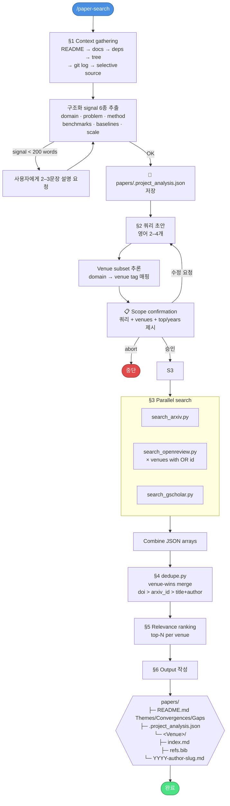
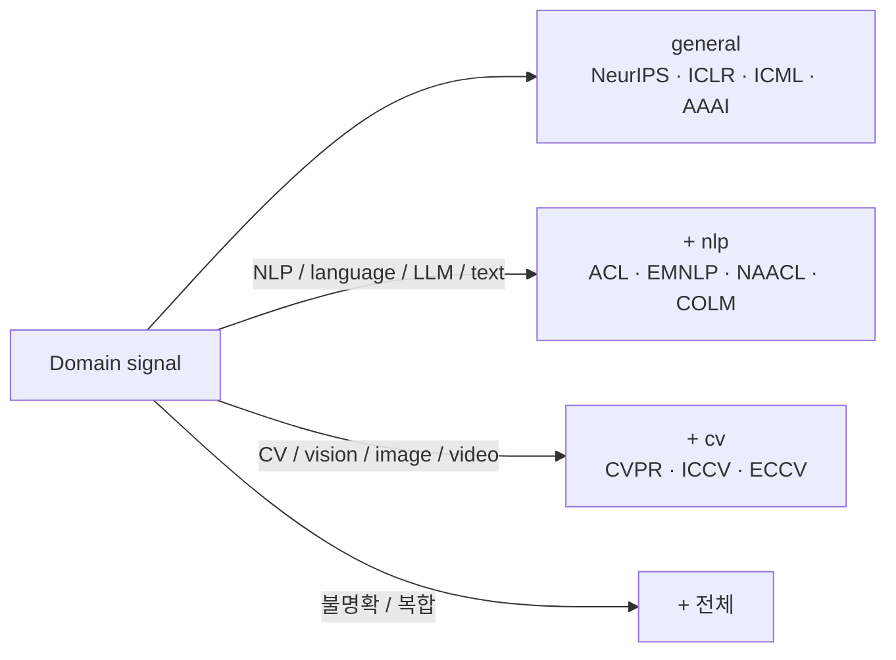

# paper-search

현재 연구 프로젝트를 분석해 **arXiv**, **OpenReview**, **Google Scholar**
에서 관련 논문을 검색한 뒤, 학회별로 정리된 related-work 디렉토리를
생성하는 Claude Code 스킬 (플러그인 형태로 배포).

연구 주제가 자주 바뀌는 ML 석·박사 과정을 위해 만들었습니다 — 매번
관련연구 폴더를 손으로 만드는 수고를 줄여줍니다.

## 동작 흐름



### Domain → venue 추론 규칙



### Per-paper 출력 구조

각 논문 `.md` 파일은 4-anchor 구조 + 프로젝트 특화 관련성:

| 섹션 | 내용 | 언어 |
|---|---|---|
| **Abstract** | 원문 verbatim | 영어 |
| **TL;DR** | 한 문장 요약 | 한국어 |
| **Method** | 방법/제안 핵심 | 한국어 |
| **Result** | 주요 결과/수치 | 한국어 |
| **Critical Reading** | 한계·가정·미진한 점 | 한국어 |
| **왜 이 프로젝트와 관련 있는가** | 본 프로젝트와의 연결고리 | 한국어 |
| **Confidence** | `high · medium · low` (venue 분류/관련성 신뢰도) | — |
| **BibTeX** | 인용용 | — |

## 타겟 학회

`skills/paper-search/config/venues.yaml` 에서 설정 가능:

| Tag | Venues |
|---|---|
| `general` | NeurIPS, ICLR, ICML, AAAI |
| `nlp` | ACL, EMNLP, NAACL, COLM |
| `cv` | CVPR, ICCV, ECCV |

학회에 매칭되지 않으면 `arxiv_only` 또는 `workshop` 버킷으로 분류.

## 설치

### 방법 A — Claude Code 플러그인 (권장)

Claude Code 세션 안에서:

```
/plugin marketplace add apple4ree/paper_search
/plugin install paper-search@paper-search
```

설치 후 Python 의존성 설치 (최초 1회):

```bash
cd "${CLAUDE_PLUGIN_ROOT}"
python -m venv .venv && source .venv/bin/activate
pip install -r requirements.txt
```

### 방법 B — 개발자 수동 설치

```bash
git clone https://github.com/apple4ree/paper_search.git
cd paper_search
./install.sh
```

`install.sh` 는 `.venv` 생성 → 의존성 설치 → `skills/paper-search/` 를
`~/.claude/skills/paper-search` 로 symlink → 전체 테스트 (23개) 실행까지
한 번에 수행합니다.

## OpenReview 자격증명 (선택이지만 권장)

OpenReview API는 인증을 요구합니다. Claude Code를 실행하는 셸에서 미리
export 하세요:

```bash
export OPENREVIEW_USERNAME="..."
export OPENREVIEW_PASSWORD="..."
```

무료 가입: <https://openreview.net/signup>

환경변수가 없으면 `search_openreview` 는 명확한 메시지와 함께 종료되고,
파이프라인은 arXiv + Google Scholar만으로 계속 진행됩니다. 단 **이 경우
venue 분류 품질이 떨어집니다** — arXiv/Google Scholar가 반환하는 venue
문자열은 자주 truncated (`"Proceedings of the …"`) 되기 때문입니다.

## 사용법

Claude Code 세션을 **연구 프로젝트 디렉토리**에서 열고:

```
/paper-search                          # 기본값: 학회당 top 10
/paper-search --top 15 --years 3       # 최근 3년, 학회당 15개
/paper-search "LLM agent planning"     # topic 문자열로 오버라이드
```

결과는 `./papers/` 에 저장됩니다.

## 개발

```bash
source .venv/bin/activate
pytest                     # 23개 단위 테스트, ~2초
pytest -m integration      # opt-in, 실제 arXiv API 호출
```

### 레포 레이아웃

```
.
├── .claude-plugin/
│   ├── plugin.json             # 플러그인 매니페스트
│   └── marketplace.json        # GitHub를 marketplace로 동작시킴
├── skills/
│   └── paper-search/
│       ├── SKILL.md            # Claude가 따르는 절차
│       ├── scripts/
│       │   ├── common.py       # Paper dataclass + 헬퍼
│       │   ├── search_arxiv.py
│       │   ├── search_openreview.py
│       │   ├── search_gscholar.py
│       │   └── dedupe.py
│       ├── config/venues.yaml  # venue 목록 + domain 태그
│       └── references/query_generation.md
├── tests/                      # 단위 + opt-in 통합 테스트
├── requirements.txt
├── install.sh                  # 개발자 설치 스크립트
└── docs/
    ├── specs/                  # 설계 스펙
    └── plans/                  # 구현 플랜
```

## 라이선스

MIT — `LICENSE` 참조.
